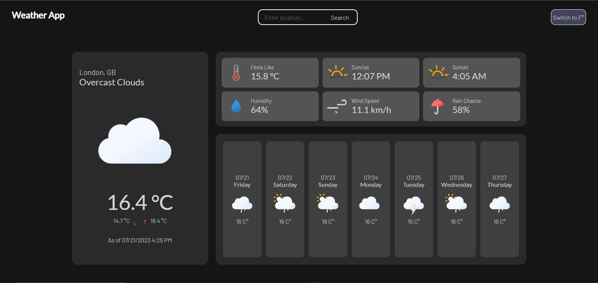

# weather-forecast

## Description

This is a simple weather forecast website project which uses weather APIs.
This is my learning experience in using async programming and APIs.

## Features

Made using:

-   webpack
-   Sass
-   JS

[Live App](https://odeeyuhlog.github.io/weather-forecast/)

